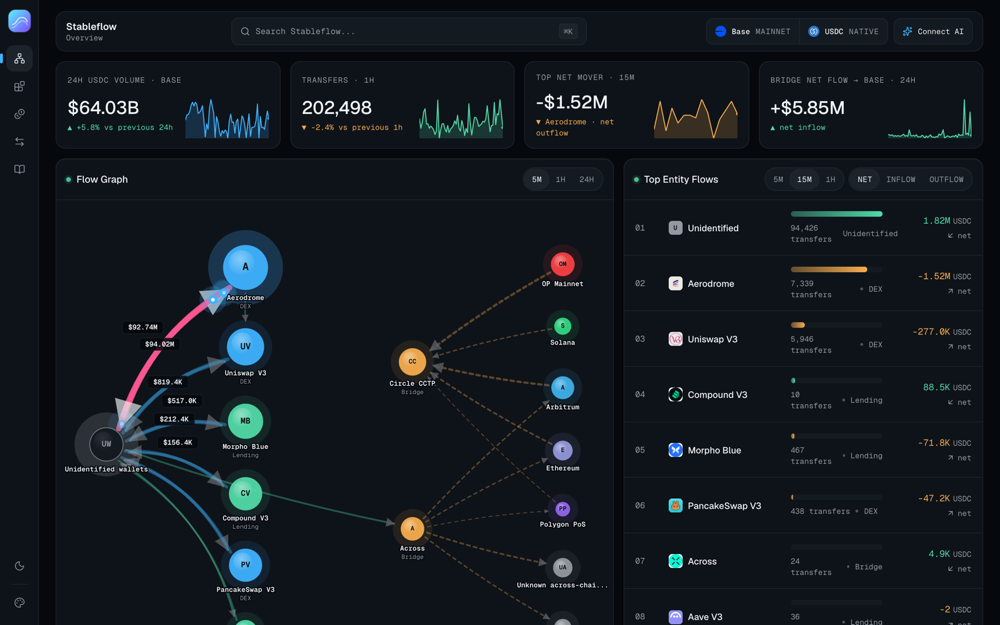
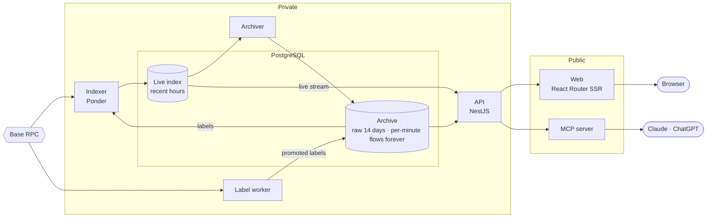
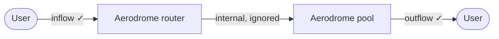
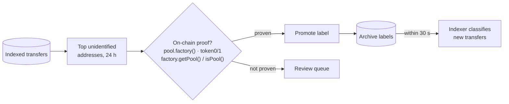
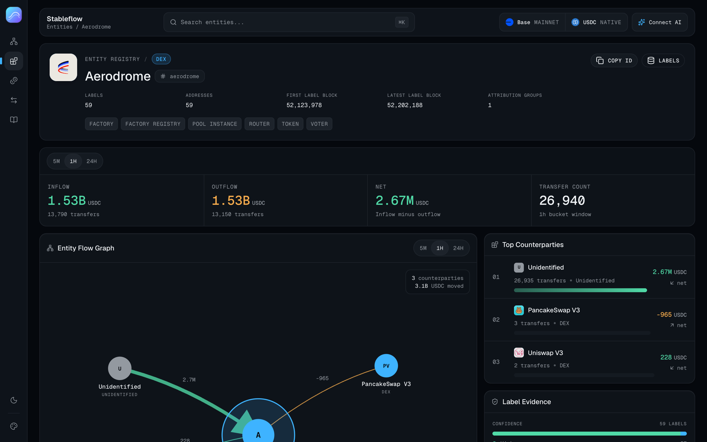
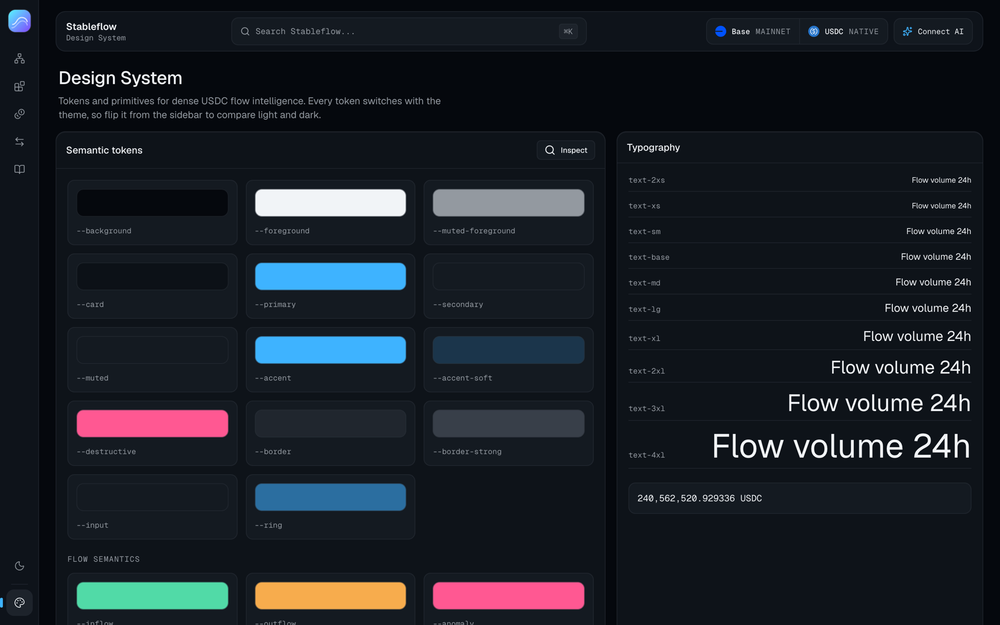

<div align="center">


# Stableflow

**Live USDC flows on Base.** See which protocols, exchanges and bridges stablecoins are moving into and out of, as it happens.

[**stableflow.dev**](https://stableflow.dev) · [Methodology](https://stableflow.dev/methodology) · [Connect your AI chat](#ask-it-from-your-ai-chat)

</div>

<picture>
  <source media="(prefers-color-scheme: light)" srcset="repo-images/overview-light.png" />
  
</picture>

## The problem

About 200,000 USDC transfers happen on Base every hour. All of them are public, and almost none of them are readable. An ERC-20 `Transfer` event only says:

```
0x787f…35e4 → 0xb2cc…dc59   268,700 USDC
```

It doesn't say *"someone sold into Aerodrome"* or *"USDC left Base for Solana through CCTP"*. Worse, one swap emits several transfers (user → router → pool → user), so adding them up counts the same dollars more than once. Block explorers show raw rows. Analytics dashboards show daily snapshots. Neither answers the simple question: **where is the money going right now?**

Stableflow indexes every native USDC transfer on Base, works out which entity is on each side, and turns the stream into live inflow, outflow and net flow per protocol, without double counting.

## What you can do

- **Watch the flow graph** as USDC moves between wallets, DEXs, lending markets and other chains, streamed live.
- **Rank entities** by inflow, outflow or net flow over windows from 5 minutes to 24 hours.
- **Follow bridges.** See USDC entering and leaving Base through Circle CCTP and Across, by remote chain.
- **Inspect any entity** down to the addresses behind it, with each label's role, source and confidence.
- **Browse every transfer**, filter large (≥10k) and whale (≥1M) moves, and open a transaction to see all its hops.
- **Search** entities, addresses and transactions with ⌘K.
- **Ask your AI chat** through a public MCP server.

## Architecture



| Service | Role |
| --- | --- |
| **Indexer** | Reads USDC transfers plus factory, CCTP and Across events. Labels both sides of each transfer and writes per-minute flow aggregates. |
| **Archiver** | Copies settled rows into the archive every two seconds and expires old raw events. |
| **Label worker** | Every six hours, finds the busiest unknown addresses and labels the ones it can prove on-chain. |
| **API** | Read-only REST plus one server-sent event (SSE) stream for live transfers. |
| **Web** | Server-rendered app. Proxies the API and the live stream, so the API never needs a public domain. |
| **MCP** | Nine read-only tools for AI clients, backed by the same API. |

Key decisions:

- **Hot and cold storage.** The indexer keeps only recent hours. The archive holds raw transfers for 14 days and per-minute aggregates forever, so queries stay fast and storage stays flat.
- **Reindex in minutes, not days.** Each indexer deployment writes to its own schema and starts a few minutes before the archive's newest block. Once it reaches the chain head, Ponder points the public views at it. Changing the schema or the classification logic causes no downtime and needs no full resync.
- **Least privilege.** Every service has its own Postgres role. The API's role is read-only, with a 30-second statement timeout.
- **One poll, many viewers.** The live stream polls the database once per API instance and fans out to every connected browser with RxJS.

## Counting flows without double counting

Every known address carries a label that says who owns it and how to count it:

```ts
{ entity: "Aerodrome", category: "dex", role: "pool_instance",
  attributionGroup: "aerodrome", countingPolicy: "boundary", confidence: "high" }
```

Flows are counted **where USDC crosses an entity's boundary**, not at every hop:



On top of that:

- **Volume counts each dollar once.** A transaction's value is the sum of every address's positive net change, so the router hop adds nothing. On early data, raw transfer sums ran about 18% higher.
- **Bridge direction comes from bridge events.** CCTP `DepositForBurn` / `MessageReceived` and Across deposits and fills give the true direction and remote chain, which an ERC-20 transfer alone can't.
- **Unknown stays unknown.** Wallets with no label are grouped as *Unidentified* rather than guessed.

## Entity discovery and promotion

Labels come from three sources, from most to least trusted:

1. **Curated registry.** Core contracts (routers, factories, lending markets, bridges) taken from official docs and repositories, each with its source and confidence.
2. **Event discovery.** The indexer listens for new Uniswap, PancakeSwap and Aerodrome pools and new MetaMorpho vaults, and re-reads Aave's reserve tokens every hour. New pools get labeled in the block they're created.
3. **Activity discovery.** A worker ranks the highest-volume *unidentified* addresses and tries to prove who they belong to.



The promotion gate is strict on purpose: **only on-chain evidence promotes a label.** The address must provably belong to a supported factory, sit on a flow boundary and map to a specific entity. Patterns like "mostly trades with Aerodrome" stay in review, because a wrong label is worse than an unknown one. Each run records how much unidentified volume it resolved, so coverage is measurable. A Postgres advisory lock keeps runs from overlapping.



## Ask it from your AI chat

```
https://mcp.stableflow.dev/mcp
```

Add it as a custom connector in Claude, or in ChatGPT's developer mode. No Stableflow account or API key needed. Then ask things like *"Which protocols had the largest net USDC outflow in the last hour?"* or *"Compare Aave V3 and Morpho Blue today."*

The server exposes nine read-only tools: transfers, transfer history, flow KPIs, top entity flows, the flow graph, the entity catalog, search, entity detail and entity comparison. It calls the private API, never the database, and every call is bounded by input schemas, request and response size caps, an upstream timeout, per-IP rate limits and a global concurrency cap. Results include the indexed time window, so answers can say when coverage is partial.

## Design system



Built for dense, real-time financial data:

- **Tokens first.** OKLCH color tokens in Tailwind 4's `@theme`, with shadcn-compatible names and a typed TypeScript copy for SVG drawing. Light and dark themes share the same tokens.
- **Color carries meaning.** Green is inflow, amber is outflow, pink flags whales. DEX, lending, bridge and CEX each keep one hue across tags, graph nodes and legends.
- **Type for numbers.** Geist for UI. Geist Mono with tabular numerals for amounts, addresses and hashes. A 13 px body, because this is a dashboard.
- **Hand-built visuals.** The flow graph, sparklines and bars are custom SVG in React, with no chart library.

Every token is on show at [/design-system](https://stableflow.dev/design-system).

## Deployment

Stableflow runs on Railway as a single project: Postgres and six services. Railway suits this workload:

- **Always-on processes.** An indexer polling every two seconds, an archiver loop, a scheduled worker and long-lived SSE connections don't fit serverless time limits. Railway runs plain containers.
- **Private by default.** Services talk over a private network. Only the web app and the MCP server have public domains. Postgres, the indexer and the API can't be reached from the internet.
- **Safe rollouts.** A new deployment only takes over once its health check passes. For the indexer, that means it has caught up to the chain head, so the old one keeps serving until then.
- **Same images locally.** Each app has its own Dockerfile. `compose.yaml` runs the same stack, roles and wiring on a laptop.
- **Pay for what runs.** Usage-based pricing fits a small always-on app: no idle cluster to pay for, no infrastructure to operate.

GitHub Actions runs Biome, type checks and builds on every pull request.

## Tech stack

| Layer | Tools |
| --- | --- |
| Indexing | Ponder, viem |
| Data | PostgreSQL 17, Drizzle ORM |
| API | NestJS 11, RxJS, Zod |
| Web | React 19, React Router 7 (SSR), TanStack Query, Tailwind CSS 4, shadcn/ui, Radix |
| AI | Model Context Protocol TypeScript SDK |
| Tooling | TypeScript, pnpm workspaces, Biome, `node:test`, GitHub Actions |
| Infra | Docker, Docker Compose, Railway |

## Run it locally

```bash
cp .env.example .env   # a Base RPC URL and a recent start block
docker compose up --build
```

Web runs on `localhost:4000`, the API on `:4001/v1` and MCP on `:4002/mcp`.

```
apps/
  indexer/   Ponder indexer, archiver and label worker
  api/       NestJS API and live stream
  web/       React Router app and design system
  mcp/       MCP server
  shared/    Types shared by the API and web
infra/postgres/roles.sql   Database roles and grants
```

---

<div align="center">

Built by [@daniserrano7](https://github.com/daniserrano7)

</div>
